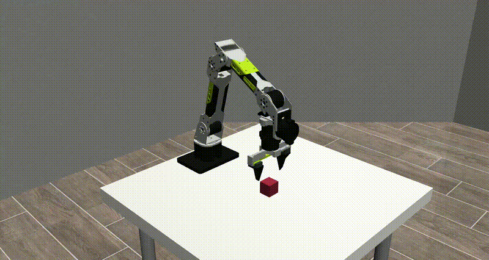
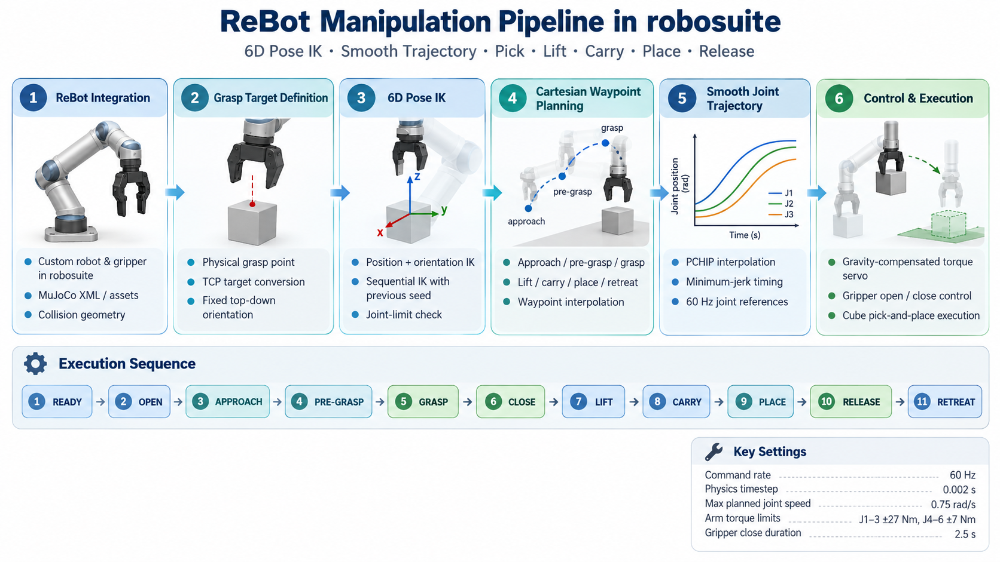

# ReBot Manipulation in robosuite

<p align="center">
  
</p>

<p align="center">
  <b>ReBot B601-DM manipulation pipeline in robosuite / MuJoCo</b><br>
  6D Pose IK · Smooth Trajectory · Pick · Lift · Carry · Place · Release
</p>

---

## 📑 Overview

본 프로젝트는 **Seeed Studio ReBot B601-DM** 로봇팔을
**robosuite / MuJoCo** 환경에 통합하고,
기본적인 manipulation pipeline을 검증하기 위한 프로젝트입니다.

ReBot의 robot / gripper model을 robosuite에 등록하고,
고정된 top-down orientation을 이용한 6D Pose IK와
smooth joint trajectory를 통해 cube manipulation을 수행합니다.

최종적으로 다음 동작을 연속적으로 수행했습니다.

```text
READY
  ↓
Open Gripper
  ↓
Approach
  ↓
Pre-grasp
  ↓
Grasp
  ↓
Close Gripper
  ↓
Lift
  ↓
Carry
  ↓
Place
  ↓
Release
  ↓
Retreat
```

현재 robosuite 기반 manipulation validation을 완료하였으며,
이후 **RoboCasa 환경으로 확장**하는 것을 목표로 합니다.

---

## 🎬 Demo

### Cube Pick-and-Place

<p align="center">
  
</p>

### Full Demo Video

[▶ Pick-and-Place Demo Video](assets/pickplace_demo.webm)

---

## 🔑 Key Features

- **ReBot B601-DM Integration**
  - ReBot robot model을 robosuite에 custom robot으로 등록
  - custom gripper 및 collision geometry 구성

- **6D Pose IK**
  - position-only IK가 아닌 position + orientation 기반 IK 사용
  - 고정된 top-down grasp orientation 유지
  - 이전 waypoint의 joint configuration을 다음 IK seed로 사용

- **Physical Grasp Point Modeling**
  - 실제 gripper finger 위치를 기준으로 physical grasp point 정의
  - physical grasp target을 기존 TCP 좌표계로 변환하여 IK 수행

- **Smooth Joint Trajectory**
  - Cartesian waypoint → sequential IK
  - joint waypoint를 PCHIP interpolation으로 연결
  - minimum-jerk timing을 이용해 부드러운 trajectory 생성

- **Gravity-Compensated Torque Servo**
  - joint-space PD control
  - MuJoCo bias / gravity compensation 적용
  - arm torque limit 및 velocity safety guard 유지

- **Complete Pick-and-Place**
  - Pick
  - Lift
  - Carry
  - Place
  - Release
  - Retreat

---

## 🤖 Robot

**Robot:** Seeed Studio ReBot B601-DM

- 6-DoF Manipulator
- Fixed Base
- Parallel Gripper
- MuJoCo Simulation
- robosuite Integration

Robot / gripper asset:

```text
project/rebot_integration/assets/
├── robots/
│   └── rebot_b601_dm/
│       └── robot.xml
│
└── grippers/
    └── rebot_b601_dm/
        └── gripper.xml
```

---

## 📐 Grasp Coordinate Definition

ReBot gripper의 physical grasp point와
robosuite에서 사용하는 TCP 위치가 동일하지 않기 때문에
grasp target을 TCP target으로 변환합니다.

```python
TCP_TO_GRASP = np.array(
    [0.090, 0.0, 0.0],
    dtype=float,
)

tcp_target = (
    grasp_point_world
    - target_rotation @ TCP_TO_GRASP
)
```

Top-down grasp orientation은 다음과 같이 사용합니다.

```python
TOP_DOWN_BASE_ROT = (
    Rotation.from_euler(
        "y",
        np.pi / 2.0,
        degrees=False,
    ).as_matrix()
)
```

즉 gripper local +X 방향이 world -Z 방향을 향하도록 하여
수직 grasp를 수행합니다.

---

## 🛠 Pipeline

<p align="center">
  
</p>

### 1. ReBot Integration

ReBot B601-DM의 robot XML과 gripper XML을
robosuite 구조에 맞게 등록합니다.

주요 파일:

```text
project/rebot_integration/rebot_b601_dm.py
```

---

### 2. 6D Pose IK

각 Cartesian target에 대해 다음 과정을 수행합니다.

```text
Physical Grasp Target
        ↓
TCP Target Conversion
        ↓
6D Pose IK
        ↓
Joint Configuration
```

Manipulation trajectory에서는 position-only IK를 사용하지 않고
항상 fixed top-down orientation을 유지합니다.

---

### 3. Cartesian Waypoint Planning

Pick / Lift / Carry / Place 구간을
Cartesian waypoint로 생성합니다.

```text
Start Pose
   ↓
Cartesian Interpolation
   ↓
6D IK for each waypoint
   ↓
Joint Waypoints
```

각 waypoint에서는 이전 joint solution을
다음 IK의 seed로 사용하여 IK branch 변화를 최소화합니다.

---

### 4. Smooth Joint Trajectory

IK를 통해 생성된 joint waypoint를 그대로 순차 실행하지 않고,
PCHIP interpolation을 이용하여 부드러운 joint trajectory를 생성합니다.

```text
Joint Waypoints
      ↓
PCHIP Interpolation
      ↓
Minimum-Jerk Timing
      ↓
60 Hz Joint Reference
```

---

### 5. Torque Servo

Arm control은 gravity compensation이 포함된
joint-space torque servo를 사용합니다.

```text
τ =
Kp(q_ref - q)
- Kv(q_dot)
+ qfrc_bias
```

사용한 gain:

```text
Joint 1~3
Kp = 300
Kv = 5

Joint 4~6
Kp = 150
Kv = 2
```

Torque limit:

```text
Joint 1~3 : ±27 Nm
Joint 4~6 : ±7 Nm
```

Command rate:

```text
60 Hz
```

MuJoCo physics timestep:

```text
0.002 s
```

Maximum planned joint speed:

```text
0.75 rad/s
```

---

### 6. Gripper Control

Gripper는 position actuator를 사용하며,
close / release 과정에서는 minimum-jerk trajectory를 사용합니다.

Gripper force limit:

```text
±8 N
```

Gripper close duration:

```text
2.5 s
```

---

## ✅ Lift Validation

먼저 robosuite의 Lift 환경에서
기본적인 grasp / lift pipeline을 검증했습니다.

```text
Approach
→ Pre-grasp
→ Descend
→ Close
→ Lift
```

실행:

```bash
cd ~/Capstone/rebot_autofocus_ws
conda activate rebot-sim

PYTHONDONTWRITEBYTECODE=1 \
NUMBA_CACHE_DIR=/tmp/rebot-numba-cache \
python -B \
project/demos/scripted_lift_expert_demo_servo.py \
--render
```

---

## ✅ Cube Pick-and-Place

Lift validation 이후 동일한 control pipeline을 확장하여
cube pick-and-place를 수행합니다.

```text
Pick
→ Lift
→ Carry
→ Place
→ Release
→ Retreat
```

실행 파일:

```text
project/demos/scripted_cube_pickplace_expert_demo_servo.py
```

실행:

```bash
cd ~/Capstone/rebot_autofocus_ws
conda activate rebot-sim

python -m py_compile \
project/demos/scripted_cube_pickplace_expert_demo_servo.py

PYTHONDONTWRITEBYTECODE=1 \
NUMBA_CACHE_DIR=/tmp/rebot-numba-cache \
python -B \
project/demos/scripted_cube_pickplace_expert_demo_servo.py \
--render
```

---

## 📊 Results

### Simple Cube Pick-and-Place

Cube를 약 **10 cm** 이동시키는 scripted pick-and-place task를 수행했습니다.

```text
Cube Start
[ 0.026541, -0.016488, 0.821444 ]

Target
[ 0.026541,  0.083512, 0.821444 ]

Final
[ 0.026807,  0.083326, 0.821444 ]
```

Result:

| Metric | Result |
|---|---:|
| XY Movement | 0.0998 m |
| Final XY Error | 0.000324 m |
| Final Z Error | 0.000000 m |
| Robot Contact after Retreat | None |
| Task Success | **True** |

전체 manipulation sequence:

```text
Grasp      PASS
Lift       PASS
Carry      PASS
Place      PASS
Release    PASS
Retreat    PASS
```

---

## 📁 Project Structure

```text
rebot-robosuite-manipulation/
│
├── README.md
├── environment.yml
│
├── assets/
│   ├── pickplace_demo.gif
│   ├── pickplace_demo.webm
│   └── pipeline.png
│
├── project/
│   │
│   ├── configs/
│   │   └── rebot_b601_dm_joint_position.json
│   │
│   ├── demos/
│   │   ├── scripted_lift_expert.py
│   │   ├── scripted_lift_expert_demo_servo.py
│   │   ├── scripted_cube_pickplace_expert_demo_servo.py
│   │   ├── validate_rebot_pickplace.py
│   │   ├── validate_rebot_pickplace_pose_ik.py
│   │   └── validate_rebot_pickplace_carry_path.py
│   │
│   └── rebot_integration/
│       ├── rebot_b601_dm.py
│       ├── reachability.py
│       ├── lift_setup.py
│       ├── lift_validation.py
│       │
│       └── assets/
│           ├── robots/
│           │   └── rebot_b601_dm/
│           └── grippers/
│               └── rebot_b601_dm/
│
└── third_party/
    └── robosuite/
```

---

## 🔧 Environment Setup

### 1. Clone Repository

```bash
git clone \
https://github.com/shinmyungji/rebot-robosuite-manipulation.git

cd rebot-robosuite-manipulation
```

---

### 2. Create Conda Environment

```bash
conda env create -f environment.yml
conda activate rebot-sim
```

---

### 3. robosuite

본 프로젝트는 robosuite 기반으로 구현되었습니다.

사용한 robosuite revision:

```text
robosuite 1.5.2
```

robosuite source는 `third_party/` 아래에서 관리할 수 있습니다.

---

## 🚀 Quick Start

Cube pick-and-place demo:

```bash
cd ~/Capstone/rebot_autofocus_ws
conda activate rebot-sim

PYTHONDONTWRITEBYTECODE=1 \
NUMBA_CACHE_DIR=/tmp/rebot-numba-cache \
python -B \
project/demos/scripted_cube_pickplace_expert_demo_servo.py \
--render
```

---

## 🏠 RoboCasa Integration

현재 robosuite 기반에서 다음 manipulation primitive의 동작을 검증했습니다.

```text
Pick
Lift
Carry
Place
Release
Retreat
```

다음 단계에서는 동일한 ReBot manipulation pipeline을
**RoboCasa kitchen environment**로 확장합니다.

예정된 pipeline:

```text
ReBot
  ↓
RoboCasa Kitchen
  ↓
Object / Receptacle Selection
  ↓
Scripted Expert
  ↓
RGB / Robot State Collection
  ↓
Imitation Learning
  ↓
Diffusion Policy
```

---

## 🎯 Future Work

- ReBot integration into RoboCasa
- Kitchen object manipulation
- Object-to-receptacle scripted demonstrations
- Multi-camera RGB observations
- Object-centric 2D / 3D representation
- Demonstration dataset generation
- Diffusion Policy training
- Visual / viewpoint generalization experiments

---

## 📚 References

- [robosuite](https://github.com/ARISE-Initiative/robosuite)
- [RoboCasa](https://github.com/robocasa/robocasa)
- [MuJoCo](https://mujoco.org/)
- [Seeed Studio reBot](https://github.com/Seeed-Projects/reBot-DevArm)

---

## 📌 Status

```text
ReBot Model Integration     ✅
Gripper Integration         ✅
6D Pose IK                  ✅
Lift                         ✅
Smooth Torque Servo         ✅
Cube Pick-and-Place         ✅
RoboCasa Integration         🚧
Imitation Learning           🚧
```
